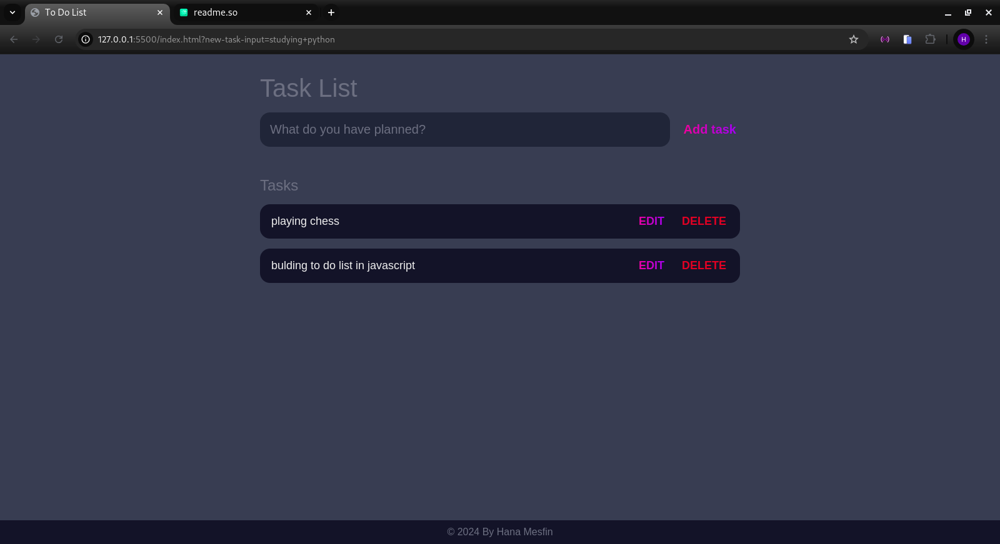
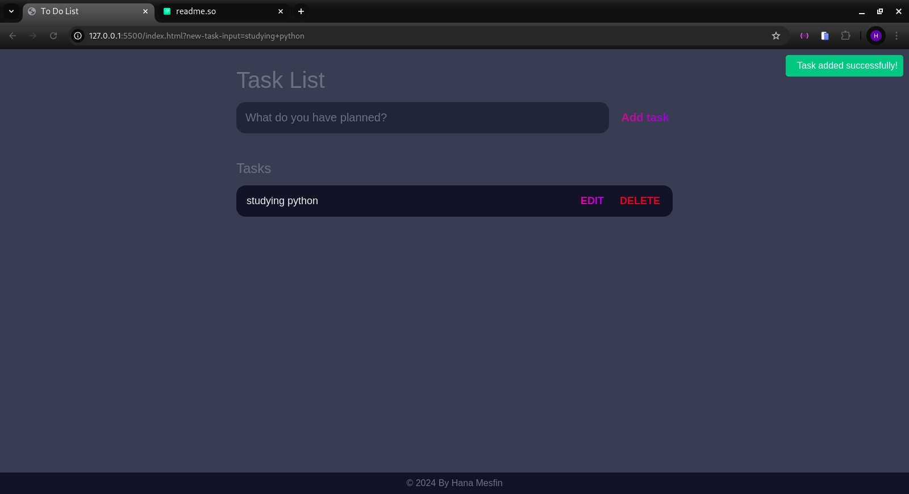
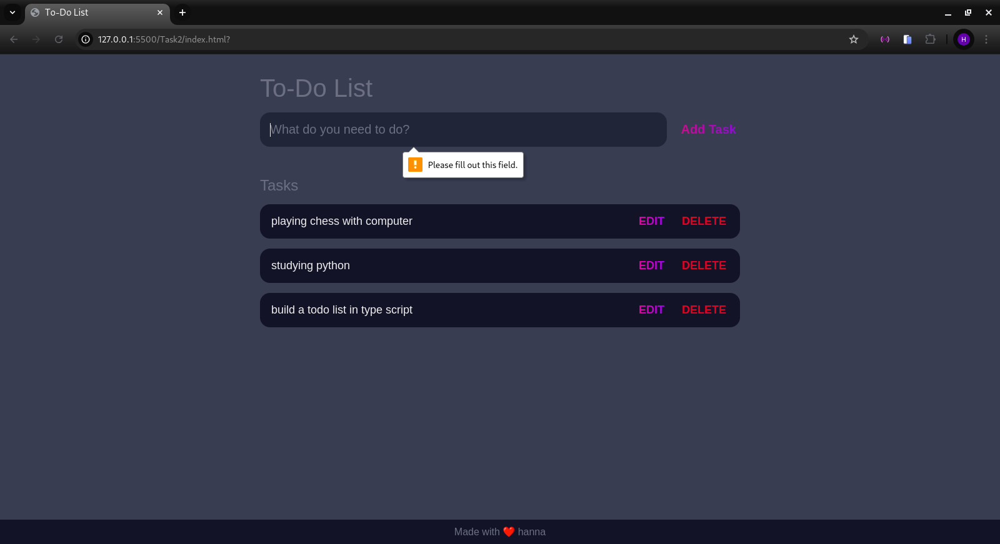

<<<<<<< HEAD
# Todo-List
=======
# Todo List App

This is a simple Todo List application built using HTML, CSS, and TypeScript.

## Features

- Add new tasks
- Delete tasks
- List tasks
- edit tasks
- save tasks

## How to Run

1. Clone the repository to your local machine.
     ```sh
   git clone https://github.com/annah11/Todo-List/Task2.git
2. Open the `index.html` file in your web browser.

## Screenshots

### Main Screen


### Adding a Task


### Task Added


>>>>>>> bbea5c7 (Initial commit)
